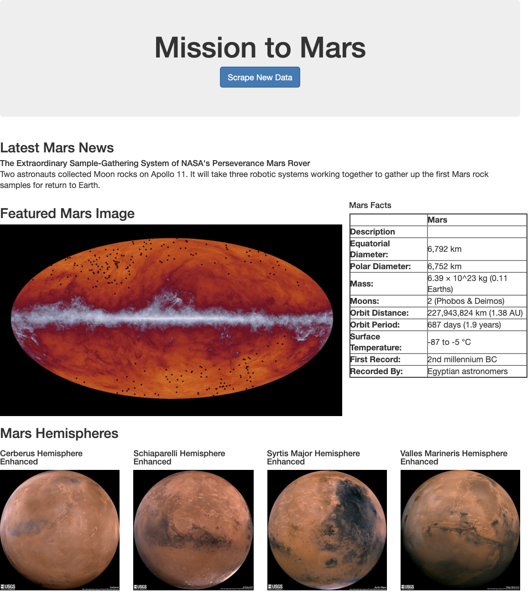

# mission-to-mars

## Challenge
Goal: To create a website to highlight Mars! In the challenge, I extended the module work to scrape images of the hemispheres of Mars from the web and display them in the website.

I created a new function in the [scraping script](apps/scraping.py) that uses Beatiful Soup and Splinter to scrape the hemisphere HTMLs and images. I then updated the [web application and flask](apps/app.py) to call this function, retreieve the data as a list of dictionaries and store it in the new MongoDB collection within my mars_app database called hemispheres. Finally, I displayed these new images using [bootstrap.](apps/templates/index.html)

Below is an image of the completed website:

